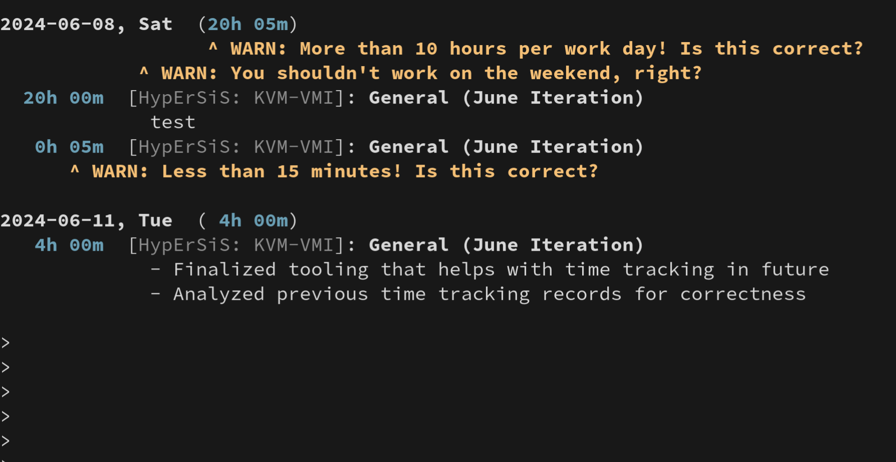

# gitlab-timelogs CLI

CLI utility to support you with your time logs in GitLab. The GitLab UI for
time logs is very rudimentary and the UX is poor (June 2024, GitLab 16.11),
especially a summary view is missing. This is where `gitlab-timelogs` help you
by leveraging the GitLab API.

This CLI is made by developers for developers who want to check their timelogs
at the of the work day or week. `gitlab-timelogs` is not associated with
the official GitLab project!


(_The screenshot is slightly outdated. The latest version shows more information._)

## Features

`gitlab-timelogs` provides you with an overview over your time logs and prints
warnings for typical mistakes.

- ✅ collect time logs from issues (timelogs associated with MRs currently not
  supported)
- ✅ group them by week
- ✅ specify time range
- ✅ print warnings for common pitfalls:
    - accounted less than 15 minutes to an issue (typically a mistake)
    - accounted time to a Saturday or Sunday (not common in normal positions)
    - accounted more than 10h a day (10h is the legal maximum in Germany)
- ✅ Created for GitLab 16.11. Older and newer versions should work as well,
     but haven't been tested. Note that the free tier may not support time
     logs, but only the enterprise edition.

## Supported Platforms

`gitlab-timelogs` builds and runs at least on the following platforms:

- Linux (all architectures, I guess?)
- MacOS (all architectures, I guess?)

## Install

**Via cargo:**

- `cargo install --git https://github.com/phip1611/gitlab-timelogs`

**Via Nix:**

- Option A: Add `gitlab-overview.nixosModules.default` (`gitlab-overview` is
  referring to the flake input) to the modules of your NixOS configuration,
  which will add `gitlab-timelogs` to your system-wide packages.
- Option B: `$ nix shell github:phip1611/gitlab-timelogs`
- Option C: add this flake as input and add the package into your system config

## Usage

- `$ gitlab-timelogs --help`
- `$ gitlab-timelogs --host gitlab.vpn.cyberus-technology.de --username pschuster --token ********** --after 2024-06-01 --before 2024-06-30`

### Configuration

1. Via CLI options. Type `--help` for guidance.
2. Via environment variables:
    - `GITLAB_HOST`
    - `GITLAB_USERNAME`
    - `GITLAB_TOKEN`
3. Via a `~/.config/gitlab-timelogs/config.toml` file:
    ```toml
    gitlab_host = "gitlab.example.com"
    gitlab_username = "<user>"
    gitlab_token = "<token>"
    ```

## MSRV

The MSRV is Rust stable `1.74.0`.

## Trivia

I created this as part of my work time at [Cyberus Technology GmbH](https://cyberus-technology.de)
to boost our internal productivity. We love open source! Interested in a
cool employer? Contact us!
